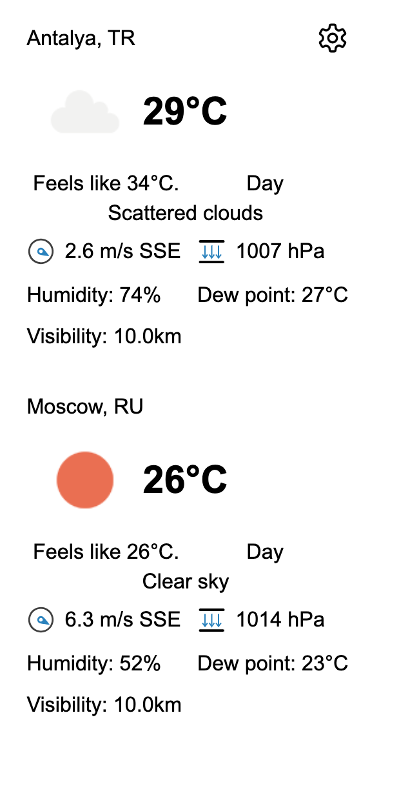
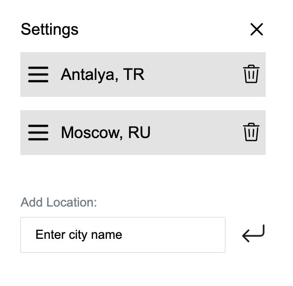

# weather-widget

P.S. This repository contains the weather-widget project developed by Igor Kobozev.
Tech: Vue.js,vuex,vue-persist, ES7 and Babel, SCSS, Webpack,vuedraggable

1. Users can be able to add this widget to their websites as simple as inserting the snippet into an HTML-page:

```
<weather-widget />
<script type="text/javascript" src="{URL to the app}/js/app.js"></script>

```

2. Widget looks like this:
   

3. Used this api url: http://api.openweathermap.org

4. After clicking the ‘Gear’ button at the upper-right corner, switch the view to the following:
   

5. information settings saves in the local storage and restore it on future visits with vuex-persist

6. By default, on initial opening, app requests the current user’s location and display the weather in their city.

## node

node - v >= v14

recommended:
v14.18.0

## Project setup

```
npm install

```

### Compiles and hot-reloads for development

```
npm run serve
```

### Compiles and minifies for production

```
npm run build
```
